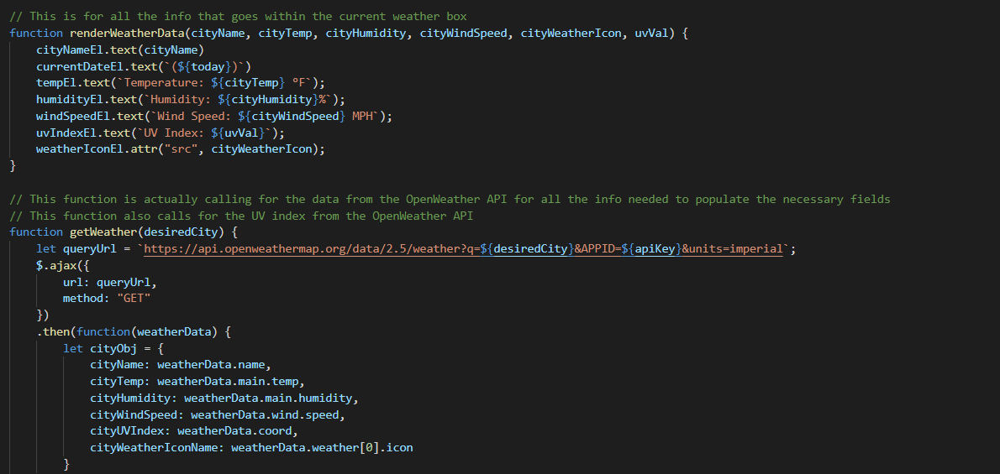
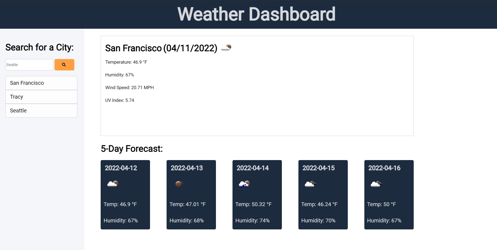

# chance-of-meatballs

## Deplyed Webpage

[Link to webpage](https://snehitak20.github.io/chance-of-meatballs/)

## Description

The goal of this project is to create a weather dashboard that displays the current weather forecast for the city that has been searched. For current weather, the city name, the date, an icon of the weather, humidity levels, wind speed, and UV index are included. A 5-Day forecast is also included for that city with the dates, temperatures, humidity levels, and weather icons for that city over the next 5 days. When a city is searched, that search result is saved and users are able to once again click on that search history to pull up the weather dashboard for that city.

The main objective of this project is to build the weather dashboard from scratch. For this project, HTMl, CSS, and JavaScript files are built from scratch. Within the HTML file, it is vital that the appropriate CSS frameworks (Bootstrap), Google Fonts, Ajax, JavaScript, and Font-awesome are all linked to help with the functionality of the webpage. The use of the `class= "row"` and `class="col"` elements is crucial because it helps to build the entire layout of the page. While Bootstrap is used within the HTML file to help with the CSS framework, CSS properties were still modified within the CSS file to create a more user-friendly interface. The bulk of the work is within the JavaScript file. Most importantly, the OpenWeatherApp API was used to call the data that is needed to display for the weather. The use of `ajax` allows for a request to be sent to the API, and then the data is pulled from the API to display onto the webpage. The use of `JSON.parse` is necessary to parse out only the necessary information that is needed from the API. The use of `localStorage` is key as it helps store the searched city, and later allows the user to access that search history and see the results. Lastly, comments are annotated throughout the files to follow along with what is occuring within that file. 

## Technologies Used: 
- HTML5
- CSS3
- JavaScript

## Usage

To access a certain city's weather, enter the city within the search bar, and hit enter. The webpage will be populated with both the current weather and 5-day weather forecast for that city. To access a previous search history result, just click on the city, and the resuls will show up. 

## Installation

1. Create a new repository on Github. 
    - Press the "+" sign on the top right hand corner, or the "new" button on your GitHub homepage. 
    - Create an unique name for your repository, and make the respository public. 
    - Click the "README" option to include the "README" page. 
    - Your new repository has been created.
2. Open GitBash (PC users) or Terminal (Mac users).
    - Navigate to where you want to clone your new repository onto your local machine. 
        - Use `cd` to help you navigate. 
3. To clone the new repository onto your local machine. 
    - Click the respository that you just made on github.com.
    - Click the "code" button and choose the SSH option. 
    - Copy the SSH option to your clipboard. 
    - On GitBash/Terminal, enter the command `git clone git@github.com:<UserNAME>/<demo-repo>.git`
        - After `git clone`, paste the SSH option from your clipboard into GitBash/Terminal.
        - Since the SSH option was used, enter the password for the SSH key when asked. 
4. You have now cloned your new repository.
    - Using `cd`, navigate into your new repository from the location that you have saved it in. 
    - Use `ls` to see what is inside the new repository currently. 
        - It should only include the README page as of now.
5. Tranferring the project files into your new directory on your local machine. 
    - Using Finder/Explorer, copy the corresponding files that are needed to edit your project. 
    - In another Finder/Explorer window, navigate to your new repository, and paste the files directly into that folder. 
6. On GitBash/Terminal, after pasting the project files into the new repository. 
    - Use `ls` to see what is now inside the new repository.
        - This should now include the README page, and the project files that you have copy-pasted in. 
7. Use `git status` to see if there any changes that need to be made to the repository. 
    - At this point, git will tell you that there is an untracked file .
8. Use `git add .` to add the new project files, and allow the new files to be tracked by git.
9. Use `git commit -m "add base project files"` to commit the changes have recently been made to the repository. 
10. Use `git push origin main` to sync your local machine with GitHub. 
    - Enter your SSH password when prompted. 
11. Use `code .` to open the files on a code reader of your choice.
12. Edit the files as necessary in your code reader. 
13. Periodically, and when you are finished with editing your code: 
    - Follow Steps 7-10 to keep your repository up to date with the changes that have been made. 
14. How to deploy the webpage:
    - After one final push to the repository, direct yourself to the repository's settings. 
    - Click the "pages" option from the sidebar. 
    - Select "main branch" as the source, and check that it selected for the "root" option. 
    - Click "Save" to deploy your webpage. 
    - *Give 5-10 minutes for the webpage to display the full contents.
15. You have successfully completed this project!

## Credits

Initial prompt given by UC Berkeley Extension, Coding Bootcamp. 

## Reflection

For this project, it was important to learn the usage of the fetch and ajax protocols within JavaScript in order to retreive data from the API. LocalStorage is once again a key player here in order to store data from the API. It is also important to learn the use of Bootstrap to create an appropriate layout. This website stands out because it is a functional weather dashboard. I was not able to get the UV index colors in on time, and that is my fault. 

## License

Licensed under the [MIT](https://choosealicense.com/licenses/mit/#) license. 

## Contributors

Feel free to reach out to me at the following: 
* [LinkedIn](https://www.linkedin.com/in/snehita-kolli-0abb23b1/)
* [GitHub](https://github.com/snehitak20)
